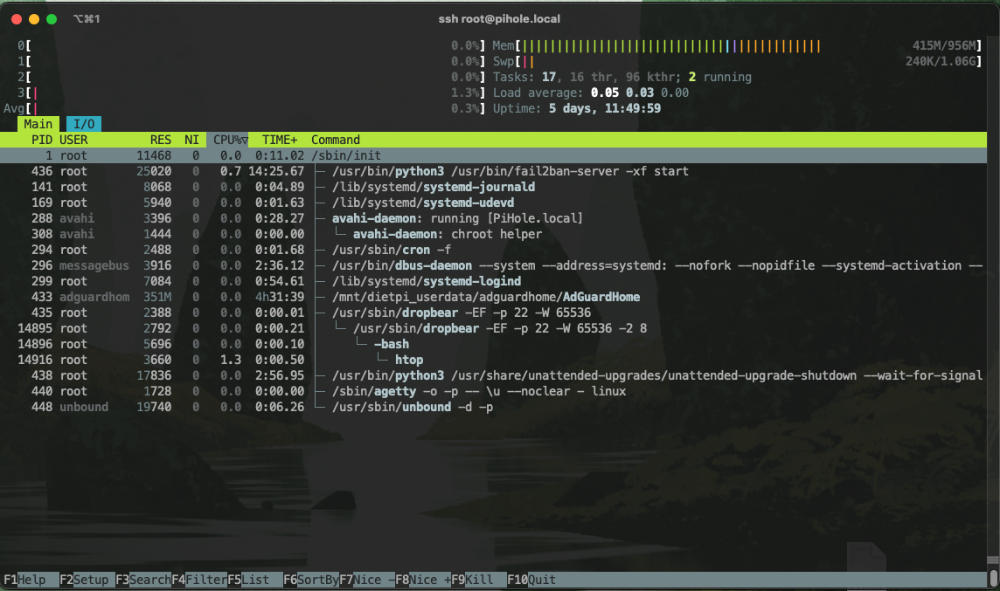

# Task 1: Linux Troubleshooting (Hands-on)

## Description

> "This Linux VM is just really sluggish"

Describe:

- How to figure out if the culprit is CPU, RAM, disk I/O, or network
- First 2-3 actions to try to fix it, and why those

**Deliverable:**
Short troubleshooting note showing commands and interpretation of results

## Let's go

1. Check the example commands mentioned in the task (`top`, `vmstat`, `iostat`) (or google what options exist by default on the given OS)

How does the output look like? Is it helpful right off the bat?

2. Check the `man` page for each.

`top`'s default sorting is by PID. I bet there's a way to sort by resource usage.
And there is:

```bash
 -o key  Order the process display by sorting on key in descending order.
```

Cool! This way I can see which processes eat up the most resources, however I would need to check for each one separately... While the info itself is pretty useful I have to say I'm not a big fan of `top` so far.

What about `iostat`? Checking the `man` page for it:

```bash
The iostat utility displays kernel I/O statistics on terminal, device and cpu operations.
```

Hm okay. A one second output of it. There is a way to loop over x amount of seconds but come on... neat info for disk usage, I guess, but `top` was more helpful and showed live stats.

Oh yeah I remember `dmesg`.. A nightmare spam that's only helpful if you really know what your're looking for and maybe grepping (filtering) it.

So far `top` was the most useuful tool. However `htop` also exists 😏

I'm working with MacOS, which does not have `htop` on it by default, but luckily I have a Raspberry Pi sitting on my network which runs Adguard Home for blocking ads / sites on a network level.

After SSH-ing into it:



<!-- Not a heading... -->
<!-- markdownlint-disable MD036 -->
*I love it*

<!-- Disabling linter rule because I have to resize the image -->
<!-- markdownlint-disable MD033 -->


Not only is it showing live stats, it even has a wonderful visual feedback showing relative usage of each resource usage. Awesome!

## Cool, but knowing is only half the battle

Now depending on which resource is getting hogged we need a gameplan for each for this task.

>[!NOTE] Disclaimer: AI (Claude) & duckduckgo was used to research here.
However I'm trying to apply my own thinking as much as possible.

### CPU & RAM

Fixing CPU and RAM should be rather straightforward.
Disable / kill unnecessary processes, clear caches and maybe increase swap space for RAM.

Recently I learned about `nice` through a YouTube video. According to a quick search it is possible to lower the priority of processes using that or `renice`. This can be applied to less important processes.

Alternatively assign more resources to the VM. I know AWS Lambdas can be faster when having more RAM due to scaling with CPU power as well. This probably applies to EC2 instances as well.

### disk I/O

I have to admit, I know less about disk tooling and networking. But I do know that a full disk can cause slowdowns!

If possible a cleanup of non-critical files should take place here (a lightweight image / VM configuration could be used to avoid this from the very beginning).

### Network

I don't have much confidence or expertise regarding networking, much less diagnosing bottlenecks... I know `traceroute` exists and could be helpful. In the best case a dashboard exits and could be worth a look.

This is definitely a step I would ask a colleague or Claude for.

## Summary

The first 2-3 actions I would take would be:

1. Check the resource usage using `htop`
2. Focus on CPU and RAM fixing / improvement. Seems like a low-hanging-fruit that could fix most issues already.
3. If feasible, adjust VM capacity
