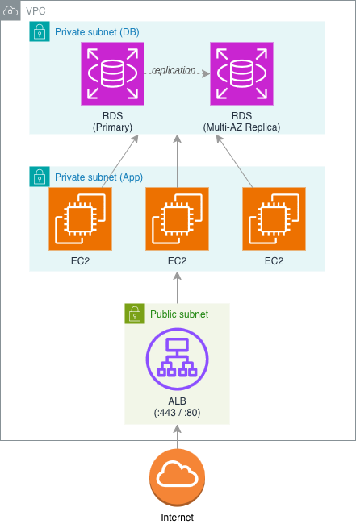

# Task 3: AWS Networking & Security Groups

## Description

Standard 3-tier setup in AWS:3

1. ALB in front
2. EC2 running in the app
3. RDS instance for DB
4. All running inside a single VPC

Design a set of security groups that:

- Only allow HTTPs from public internet to ALB
- Allow the ALB to talk to app server
- Allow the app servers to reach RDS only from DB port

Include ports & protocols you'd open, explain each rule

**Deliverable:**
A simple text diagram of the setup + security group rules

## Let's go

Architecture diagram created using *diagrams.net*

>[!NOTE] Disclaimer: AI (claude) & duckduckgo was used to research here.

I'll be honest. I never heard the term "Tier 3 Architecture" so I had to research.

## Security Groups

### `sg-alb`

|Direction|Type|Protocol|Port|Source              |Description       |
|---------|----|--------|----|--------------------|------------------|
|Inbound  |TCP | HTTPS  |443 |0.0.0.0/0           |Public web traffic|
|Inbound  |TCP | HTTP   |80  |0.0.0.0/0           |Redirect to HTTPS |
|Outbound |TCP | HTTP   |8080|`sg-app` (target SG)|Forward to EC2    |

Ports `443` and `80` are needed to have access to the infra at all. Traffic has to reach it somehow.

Port `8080` is ususally a default port for apps during development. A general best practice is to change it to avoid port scanning and making it harder for attackers to guess the application running it (this counts for the default DB port too!).

### `sg-app`

|Direction|Type|Protocol|Port|Source              |Description       |
|---------|----|--------|----|--------------------|------------------|
|Inbound  |TCP | HTTP   |8080|`sg-alb` (source SG)|From ALB only     |
|Inbound  |TCP | HTTP   |22  |10.0.0.0/16* (VPC)  |SSH               |
|Outbound |TCP | HTTP   |5432|sg-rds (target SG)  |DB queries        |
|Outbound |TCP | HTTPS  |443 |0.0.0.0/0           |AWS APIs, packages|

*\* default VPC CIDR. Could be make smaller if applicable.*

Port `8080` (the app port) needs to accept connections from one tier down.

Additionally port `22` is open to provide SSH access for admins.

Port `5432` (PosgreSQL) out is there to hop to the next tier and have access to DB connections for read/write operations.

Port `443` needed for the EC2 instances to make calls outside the VPC (e.g. Cloudwatch, S3 operations, STS, for package manager updates, etc.) I've heard VPC endpoints can tighen security here (so traffic stays within the VPC), but haven't used them yet.

### `sg-rds`

|Direction|Type|Protocol. |Port|Source              |Description       |
|---------|----|----------|----|--------------------|------------------|
|Inbound  |TCP | HTTP     |5432|`sg-app` (source SG)|App tier queries  |
|Outbound | *  | *        | *  |`sg-app` (target SG)|Response traffic  |
|Inbound  | -  | (blocked)| -  |0.0.0.0/0           |No internet access|

Port `5432` accepts the connection from the `sg-app` subnet.
Full traffic outwards back for responses from the DB to the instances (this could be tightened?)

Every other inbound is blocked. Databases are critical!

## Summary

Important here is that each security groups references the next higher tier above it.
`sg-app` only accepts traffic from the ALB (`sg-alb`).
`sg-rds` only accepts traffic from the app layer (`sg-app`). The DB should be completely invisible to anything else.
